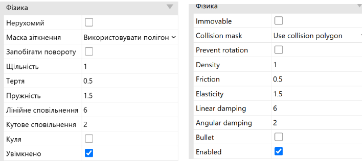

- Ѕрасе Космос 
- Physics Фізика 
- Immovable Hерухомий 
- Density Щільність 
- Damping Гасіння 
- Force Сила 
- Impulse Імпульс 
- Torque Обертальний момент
- Enemy Bopor 
- Ghost Привид
- Container Контейнер 
- Magnet Магніт
- Forward Вперед
- Towards По напрямку до
- Artificial Штучний 
- Intelligence Інтелект
