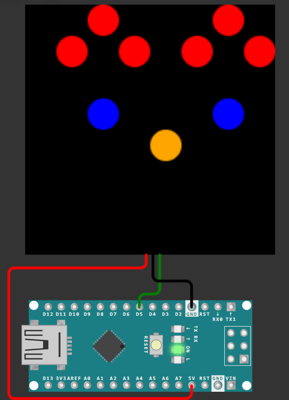

Спробуйте намалювати прапор України

[Шаблон Wokwi](https://wokwi.com/projects/419909236668027905)


``` cpp

int img[64] = { // типу котик ^_^
  0,0,1,0,0,0,1,0,
  0,1,0,1,0,1,0,1,
  0,0,0,0,0,0,0,0,
  0,0,3,0,0,0,3,0,
  0,0,0,0,8,0,0,0,
  0,0,0,0,0,0,0,0,
  0,0,0,0,0,0,0,0,
  0,0,0,0,0,0,0,0
};

#include <FastLED.h>

#define NUM_LEDS 64
#define DATA_PIN 5

CRGB leds[NUM_LEDS];

void setup() { 
  FastLED.addLeds<WS2812B, DATA_PIN, GRB>(leds, NUM_LEDS);
    
  for(int x=0; x<NUM_LEDS; x++){ leds[x] = color(img[x]); }
  FastLED.show();
}

void loop() {}

CRGB colorList[9]={
  CRGB::Black,
  CRGB::Red,
  CRGB::Green,
  CRGB::Blue,
  CRGB::Yellow,
  CRGB::Cyan,
  CRGB::Magenta,
  CRGB::White,
  CRGB::Orange
};
CRGB color(int colorNumber) { return colorList[colorNumber]; }

```

