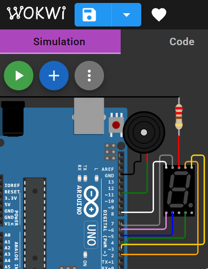

Потрібно реалізувати таймер на 5 секенд, який в кінці пищить.

[Шаблон коду та електричної схеми у Wokwi](https://wokwi.com/projects/419905930671218689)

> Підказка: функція для писку `tone( НомерНіжкиПищалки , ЧастотаПиску );`

